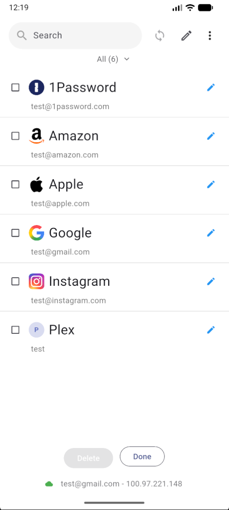
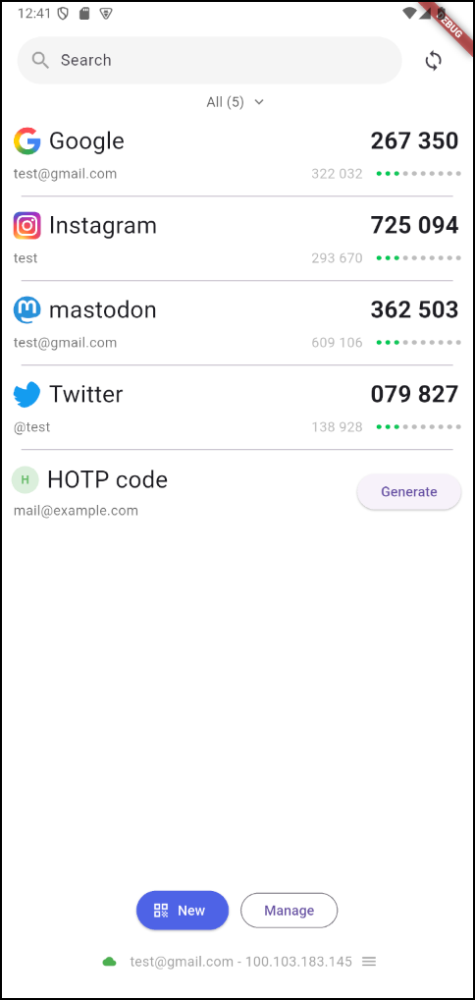
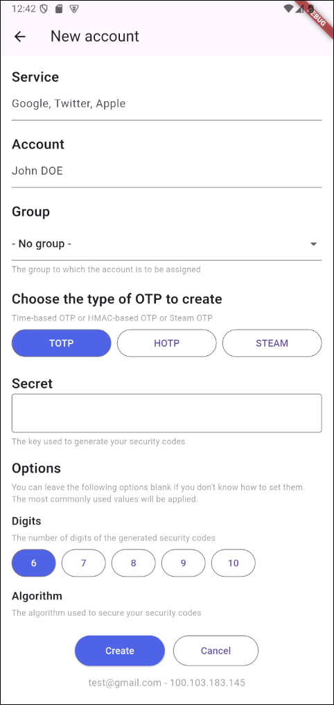
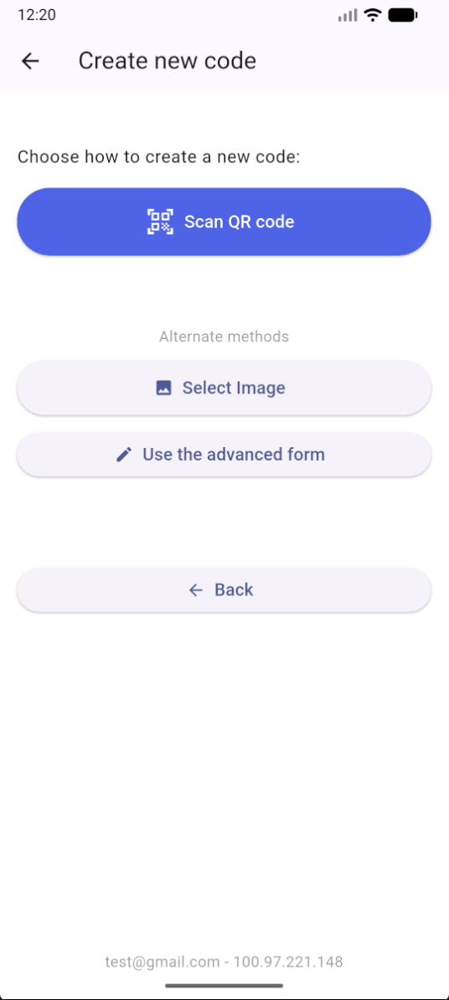
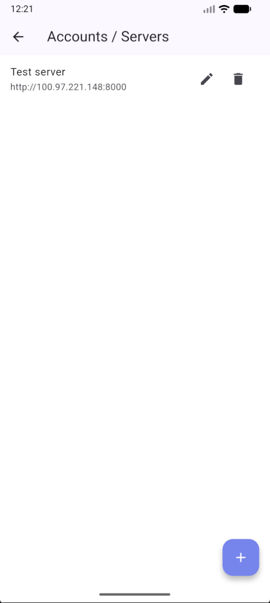

# 2FAuth Flutter Client

A mobile client application for managing two-factor authentication (2FA) codes, designed to work with the [2FAuth web application](https://github.com/Bubka/2FAuth). This Flutter-based client provides a native mobile experience while securely synchronizing with your self-hosted 2FAuth instance.

[](https://github.com/gmag11/2fauthApp/releases/latest)
[](https://www.gnu.org/licenses/agpl-3.0)


## Purpose

This project complements the official 2FAuth web application by offering:

- Native mobile experience for accessing your 2FA codes on the go
- Secure local generation of TOTP and STEAM codes
- Synchronization with your self-hosted 2FAuth server
- Offline access to your authentication codes

## Screenshots

<!-- markdownlint-disable MD033 -->
<p align="center">
   
   
   
</p>

<p align="center">
   
   
</p>
<!-- markdownlint-enable MD033 -->

**Important**: This client requires a running instance of [2FAuth](https://github.com/Bubka/2FAuth). It does not replace the web application but extends its functionality as a native mobile and desktop application.

## Features

- **Secure Code Generation**: All codes are generated locally on your device
- **Server Synchronization**: Sync your accounts and icons from your 2FAuth instance
- **Account Management**: Create, edit, and delete entries directly from the mobile app
- **Offline Access**: Access your codes even without internet connection
- **Encrypted Storage**: Your secrets are stored securely using platform encryption
- **Platform Support**: Native support for Android, Windows, and Linux
- **Biometric Protection**: Optional biometric authentication (fingerprint/face) to protect local data
- **Privacy Controls**: Option to hide OTP codes on screen for privacy, with long-press to reveal
- **Synchronization Controls**: Settings section to enable/disable automatic sync, set sync interval, and sync on app open
- **About Dialog**: View app version and project links from the new About dialog
- **Real-time Updates**: Codes refresh automatically
- **Copy to Clipboard**: One-tap copying of generated codes. Long tap to copy next OTP code.
- **Group Organization**: Browse accounts organized by groups
- **Icon Support**: Display service icons for easy identification

## Requirements

### For End Users

- A running instance of [2FAuth](https://github.com/Bubka/2FAuth) (version compatible with API specifications included in this project)
- Mobile device (Android) or Windows/Linux PC
- Internet connection for initial synchronization

### For Developers

- Flutter SDK (version 3.35.1 or compatible)
- Android Studio or VS Code with Flutter extension
- Platform-specific development tools:
  - Android: Android SDK and emulator/device
  - Windows: Visual Studio with C++ development tools

## Installation

1. **Clone the repository**:

   ```bash
   git clone [repository-url]
   cd 2fauth-client
   ```

2. **Install dependencies**:

   ```bash
   flutter pub get
   ```

3. **Run the application**:

   ```bash
   flutter run
   ```

## Usage

1. **Setup**: Open the app and navigate to Settings → Servers
2. **Add Server**: Configure connection to your 2FAuth instance (URL and API key)
3. **Synchronize**: Pull your accounts and icons from the server
4. **Create Entry**: Use the "QR" button to add a new account entry directly from the app
5. **Manage Mode**: Tap the "Edit" button to enter manage mode for editing or deleting entries
6. **Edit Entry**: In manage mode, tap the edit icon next to an entry to modify its details
7. **Delete Entry**: In manage mode, select the entries you want to delete and press the "Delete" button
8. **Access Codes**: View and copy your 2FA codes from the main accounts list
9. **Offline Use**: Codes continue to work without internet connection after initial sync

## Not implemented yet
- **Account reorder** is not implemented in current version. If you want to change order in which accounts are shown edit them in web service.

## Privacy & Security

- All secret keys remain encrypted on your device
- Code generation happens locally - secrets never leave your device
- Server synchronization uses secure HTTPS connections
- API keys and sensitive data are stored using platform secure storage

## Current Limitations

This application is in early development and may have bugs or incomplete features.

- **SVG Icon Issues**: Some SVG icons may not display correctly or may cause the app to close unexpectedly because Flutter does not fully support the SVG format. Whenever possible, use PNG icons for best compatibility.
- **Fixed Order**: Accounts cannot be reordered; the order present on the server is replicated
- **HOTP Limitations**: Offline local generation of HOTP codes is not supported. You must synchronize the counter with the server to avoid breaking the HOTP sequence
- **Platform-specific Features**: Some features like biometric authentication may have limited availability depending on the platform and device capabilities

## License

This project is licensed under the AGPL-3.0 License - see the LICENSE file for details.

## Contributing

Contributions are welcome! Please feel free to submit issues, feature requests, or pull requests to help improve this client application.

## Support

For support and questions:

- Review existing issues before creating new ones
- Ensure your 2FAuth server instance is properly configured and accessible

## Related Projects

- [2FAuth Web Application](https://github.com/Bubka/2FAuth) - The official web application that this client connects to
- [API Specifications](https://github.com/Bubka/2FAuth-API) - API documentation for developers

---

**Note**: This client requires an existing 2FAuth server instance. It is not a standalone 2FA solution but rather a mobile companion to the web application.

## Disclaimer

The author and contributors are not responsible for any errors, synchronization issues, alterations, corruption, or loss of data that may occur while using this application. Use this software at your own risk. The project is provided "as is" without any warranties or guarantees.

It is recommended to make regular backups of your data.
